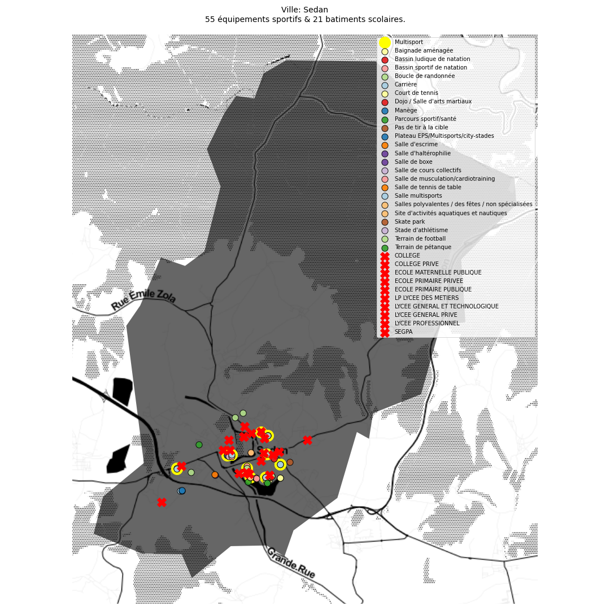

# Revue de la ville de Sedan (8409)
## Sources

Données équipements sportifs: https://www.data.gouv.fr/fr/datasets/recensement-des-equipements-sportifs-espaces-et-sites-de-pratiques/ 
Données éducation: https://www.data.gouv.fr/fr/datasets/adresse-et-geolocalisation-des-etablissements-denseignement-du-premier-et-second-degres-1/ 
Découpage communal: https://www.data.gouv.fr/fr/datasets/decoupage-administratif-communal-francais-issu-d-openstreetmap/ 
Licenses sportives 2015: https://www.data.gouv.fr/fr/datasets/donnees-geocodees-issues-du-recensement-des-licences-et-clubs-aupres-des-federations-sportives-agreees-par-le-ministere-charge-des-sports/ 
## Liste des équipements de la ville

Il y a 62 équipements sportifs pour 17841 habitants, soit un ratio de 34 équipements pour 10.000 habitants.

|    | Type d'équipement                                  |   Nombre de fiches |   Nombre d'équipements |
|---:|:---------------------------------------------------|-------------------:|-----------------------:|
|  0 | Salle multisports                                  |                  9 |                      9 |
|  1 | Salle de musculation/cardiotraining                |                  8 |                      8 |
|  2 | Plateau EPS/Multisports/city-stades                |                  4 |                      4 |
|  3 | Terrain de football                                |                  4 |                      4 |
|  4 | Dojo / Salle d'arts martiaux                       |                  4 |                      4 |
|  5 | Terrain de pétanque                                |                  3 |                      3 |
|  6 | Salle de tennis de table                           |                  2 |                      2 |
|  7 | Baignade aménagée                                  |                  2 |                      2 |
|  8 | Manège                                             |                  2 |                      2 |
|  9 | Court de tennis                                    |                  2 |                      9 |
| 10 | Boucle de randonnée                                |                  2 |                      2 |
| 11 | Parcours sportif/santé                             |                  1 |                      1 |
| 12 | Pas de tir à la cible                              |                  1 |                      1 |
| 13 | Salle d'escrime                                    |                  1 |                      1 |
| 14 | Bassin ludique de natation                         |                  1 |                      1 |
| 15 | Salle de boxe                                      |                  1 |                      1 |
| 16 | Salle de cours collectifs                          |                  1 |                      1 |
| 17 | Carrière                                           |                  1 |                      1 |
| 18 | Salles polyvalentes / des fêtes / non spécialisées |                  1 |                      1 |
| 19 | Site d'activités aquatiques et nautiques           |                  1 |                      1 |
| 20 | Skate park                                         |                  1 |                      1 |
| 21 | Stade d’athlétisme                                                    |                  1 |                      1 |
| 22 | Bassin sportif de natation                         |                  1 |                      1 |
| 23 | Salle d'haltérophilie                              |                  1 |                      1 |

## Vue d'ensemble de la ville

## Revue des équipements 

|       |     ID | Complexe                                                 | Equipement                               | Type                                               |   Nombre | Gestionnaire                   |   Année de mise en service |   Categorie ERP |
|------:|-------:|:---------------------------------------------------------|:-----------------------------------------|:---------------------------------------------------|---------:|:-------------------------------|---------------------------:|----------------:|
| 18178 | 247623 | Tennis Club Sedanais Int                                 | Court de Tennis Couvert                  | Court de tennis                                    |        5 | Commune                        |                       1980 |               4 |
| 18179 | 247642 | Tennis Club Ext                                          | Tennis Ext                               | Court de tennis                                    |        4 | Commune                        |                       1983 |               4 |
| 18180 | 247652 | Stand de Tir Robert Clouet                               | Stand de Tir Robert Clouet               | Pas de tir à la cible                              |        1 | Commune                        |                       1989 |               0 |
| 18186 | 290136 | Stade de Football Michel Charlot                         | Stade de Football Michel Charlot         | Terrain de football                                |        1 | Commune                        |                       2008 |               5 |
| 18160 | 247308 | Stade Louis Dugauguez                                    | Stade Louis Dugauguez                    | Terrain de football                                |        1 | EPCI                           |                       2000 |               1 |
| 18161 | 247317 | Stade Louis Dugauguez                                    | Salle d'Echauffement                     | Salle de musculation/cardiotraining                |        1 | EPCI                           |                       2000 |               0 |
| 18174 | 247567 | Stade D Athletisme                                       | Stade Athletisme                         | Stade d'athlétisme                                 |        1 | Commune                        |                       2003 |               0 |
| 18187 | 317024 | Stade Andre Victoor                                      | Terrain de Football Synthétique          | Terrain de football                                |        1 | Commune                        |                       2010 |               0 |
| 18207 | 360858 | Skate Park                                               | Skate Park                               | Skate park                                         |        1 | Commune                        |                       2015 |               5 |
| 18169 | 247450 | Salle de Combat                                          | Salle Budo Traditionnel                  | Dojo / Salle d'arts martiaux                       |        1 | Commune                        |                          0 |               0 |
| 18197 | 330701 | Salle d'Escime                                           | Salle de Gym                             | Salle de cours collectifs                          |        1 | Commune                        |                          0 |               0 |
| 18196 | 330699 | Salle d'Escime                                           | Salle d'Escrime                          | Salle d'escrime                                    |        1 | Commune                        |                          0 |               0 |
| 18170 | 247464 | Salle Specialisee Goshindo                               | Salle Specialisee Goshindo               | Dojo / Salle d'arts martiaux                       |        1 | Commune                        |                          0 |               0 |
| 18182 | 247690 | Salle Multisports                                        | Gymnase Jb Clement                       | Salle multisports                                  |        1 | Région                         |                       2000 |               4 |
| 18168 | 247437 | Salle Marcel Schmitt                                     | Salle Marcel Schmitt                     | Salle multisports                                  |        1 | Commune                        |                          0 |               2 |
| 18166 | 247407 | Salle Marcel Schmitt                                     | Salle Karate                             | Dojo / Salle d'arts martiaux                       |        1 | Commune                        |                          0 |               2 |
| 18167 | 247417 | Salle Marcel Schmitt                                     | Salle Gym                                | Salles polyvalentes / des fêtes / non spécialisées |        1 | Commune                        |                          0 |               2 |
| 18158 | 247273 | Plaine de Jeux                                           | Terrain Petanque                         | Terrain de pétanque                                |        1 | Commune                        |                          0 |               0 |
| 18157 | 247262 | Plaine de Jeux                                           | Plateau Eps                              | Plateau EPS/Multisports/city-stades                |        1 | Commune                        |                          0 |               0 |
| 18189 | 319799 | Parcours Sportif                                         | Parcours de Santé                        | Parcours sportif/santé                             |        1 | Commune                        |                       2007 |               0 |
| 18199 | 330755 | Maison de la Formation                                   | Salle de Tennis de Table                 | Salle de tennis de table                           |        1 | Commune                        |                          0 |               0 |
| 18198 | 330754 | Maison de la Formation                                   | Salle de Boxe                            | Salle de boxe                                      |        1 | Commune                        |                          0 |               0 |
| 18185 | 287465 | La Marche de la Division Marguerite (Randonnée Pédestre) | La Marche de la Division Marguerite      | Boucle de randonnée                                |        1 | Commune                        |                          0 |               0 |
| 18153 | 247199 | Gymnase Turenne                                          | Gymnase Turenne                          | Salle multisports                                  |        1 | Département                    |                          0 |               0 |
| 18162 | 247355 | Gymnase Torcy Cites                                      | Gymnase Torcy Cites                      | Salle multisports                                  |        1 | Commune                        |                       1965 |               0 |
| 18201 | 330868 | Gymnase Lycée Pierre Bayle                               | Salle de Musculation                     | Salle de musculation/cardiotraining                |        1 | Région                         |                       2010 |               3 |
| 18202 | 330870 | Gymnase Lycée Pierre Bayle                               | Salle Musculation                        | Salle de musculation/cardiotraining                |        1 | Région                         |                       2010 |               3 |
| 18200 | 330865 | Gymnase Lycée Pierre Bayle                               | Salle Multisports                        | Salle multisports                                  |        1 | Région                         |                       2010 |               3 |
| 18172 | 247484 | Gymnase Crussy                                           | Salle Tennis de Table                    | Salle de tennis de table                           |        1 | Région                         |                          0 |               4 |
| 18173 | 247492 | Gymnase Crussy                                           | Salle Musculation                        | Salle de musculation/cardiotraining                |        1 | Région                         |                          0 |               4 |
| 18171 | 247477 | Gymnase Crussy                                           | Gymnase Crussy                           | Salle multisports                                  |        1 | Commune                        |                          0 |               4 |
| 18175 | 247582 | Gymnase 2                                                | Cosec                                    | Salle multisports                                  |        1 | Commune                        |                          0 |               4 |
| 18181 | 247672 | Gymnase                                                  | Gymnase Fresnois                         | Salle multisports                                  |        1 | Département                    |                       2003 |               3 |
| 18206 | 343629 | Fit'N Form                                               | Fit'N Form                               | Salle de musculation/cardiotraining                |        1 | Etablissement privé commercial |                       2014 |               5 |
| 18159 | 247292 | Espace Multisport                                        | Espace Mutlisport                        | Plateau EPS/Multisports/city-stades                |        1 | Commune                        |                       2004 |               0 |
| 18205 | 336261 | Crazy Gym                                                | Crazy Gym                                | Salle de musculation/cardiotraining                |        1 | Etablissement privé commercial |                       2012 |               5 |
| 18165 | 247393 | Cosec Porte de Balan                                     | Cosec Porte de Balan                     | Salle multisports                                  |        1 | Commune                        |                          0 |               4 |
| 18176 | 247598 | Cosec Esplanade                                          | Salle Specialisee Judo                   | Dojo / Salle d'arts martiaux                       |        1 | Commune                        |                          0 |               0 |
| 18177 | 247607 | Cosec Esplanade                                          | Salle Halterophilie                      | Salle d'haltérophilie                              |        1 | Commune                        |                          0 |               0 |
| 18190 | 321684 | Circuit du Pays Sedanais (Cyclotourisme)                 | Circuit du Pays Sedanais (Cyclotourisme) | Boucle de randonnée                                |        1 | Commune                        |                          0 |               0 |
| 18195 | 330695 | Centre Nautique de la Moskowa                            | Salle de Musculation                     | Salle de musculation/cardiotraining                |        1 | Commune                        |                       2011 |               0 |
| 18194 | 330694 | Centre Nautique de la Moskowa                            | Centre Nautique                          | Site d'activités aquatiques et nautiques           |        1 | Commune                        |                       2011 |               0 |
| 18188 | 317925 | Centre Equestre du Fresnois                              | Manège                                   | Manège                                             |        1 | Etablissement privé commercial |                       2006 |               0 |
| 18183 | 276587 | Centre Equestre du Fresnois                              | Centre Equestre du Fresnois              | Carrière                                           |        1 | Etablissement privé commercial |                       2003 |               0 |
| 18184 | 276588 | Centre Equestre du Fresnois                              | Centre Equestre de Fresnois              | Manège                                             |        1 | Etablissement privé commercial |                       2003 |               0 |
| 18193 | 327595 | Centre Aquatique du Pays Sedanais                        | Salle Cardio                             | Salle de musculation/cardiotraining                |        1 | EPCI                           |                       2011 |               2 |
| 18191 | 327593 | Centre Aquatique du Pays Sedanais                        | Centre Aquatique du Pays Sedanais        | Bassin sportif de natation                         |        1 | EPCI                           |                       2011 |               2 |
| 18192 | 327594 | Centre Aquatique du Pays Sedanais                        | Bassin Ludique                           | Bassin ludique de natation                         |        1 | EPCI                           |                       2011 |               2 |
| 18164 | 247380 | Boulodrome Roger Clauss                                  | Boulodrome Roger Clauss Ext              | Terrain de pétanque                                |        1 | Commune                        |                          0 |               0 |
| 18163 | 247372 | Boulodrome Roger Clauss                                  | Boulodrome Roger Clauss                  | Terrain de pétanque                                |        1 | Commune                        |                       1993 |               3 |
| 18204 | 330913 | Baignade du Lac                                          | Baignade du Lac de Sedan                 | Baignade aménagée                                  |        1 | Commune                        |                          0 |               0 |
| 18203 | 330912 | Baignade du Lac                                          | Baignade du Lac                          | Baignade aménagée                                  |        1 | Commune                        |                          0 |               0 |
| 18156 | 247247 | Air de Jeux Jf Dury                                      | Terrain Foot                             | Terrain de football                                |        1 | Commune                        |                       1996 |               0 |
| 18154 | 247228 | Air de Jeux Jf Dury                                      | Terrain Basket / Handball                | Plateau EPS/Multisports/city-stades                |        1 | Commune                        |                       1994 |               0 |
| 18155 | 247237 | Air de Jeux Jf Dury                                      | Panneau de Basket                        | Plateau EPS/Multisports/city-stades                |        1 | Commune                        |                       1996 |               0 |

## Revue des collèges et lycées

|       | Etablissement                                                                                   | Type                           |   Equipement le plus proche (m) | Type                      | Complexe                   |
|------:|:------------------------------------------------------------------------------------------------|:-------------------------------|--------------------------------:|:--------------------------|:---------------------------|
|  1401 | Collège Turenne                                                                                 | COLLEGE                        |                             127 | Gymnase Turenne           | Gymnase Turenne            |
|  5518 | Lycée général privé Mabillon                                                                    | LYCEE GENERAL PRIVE            |                             286 | Plateau Eps               | Plaine de Jeux             |
|  5540 | Ecole primaire Leclerc-Adam                                                                     | ECOLE PRIMAIRE PUBLIQUE        |                             655 | Gymnase Jb Clement        | Salle Multisports          |
|  5546 | Ecole primaire l'Esplanade                                                                      | ECOLE PRIMAIRE PUBLIQUE        |                             213 | Salle Multisports         | Gymnase Lycée Pierre Bayle |
| 14067 | Lycée professionnel Jean-Baptiste Clément - Lycée des métiers de l'automobile et de l'industrie | LP LYCEE DES METIERS           |                             215 | Gymnase Jb Clement        | Salle Multisports          |
| 15234 | Ecole primaire Georges Ouvrard                                                                  | ECOLE PRIMAIRE PUBLIQUE        |                             391 | Gymnase Turenne           | Gymnase Turenne            |
| 15236 | Ecole maternelle la Plage                                                                       | ECOLE MATERNELLE PUBLIQUE      |                             433 | Terrain Basket / Handball | Air de Jeux Jf Dury        |
| 20508 | Lycée général et technologique Pierre Bayle                                                     | LYCEE GENERAL ET TECHNOLOGIQUE |                             784 | Espace Mutlisport         | Espace Multisport          |
| 27463 | Ecole primaire Frénois                                                                          | ECOLE PRIMAIRE PUBLIQUE        |                            1613 | Gymnase Fresnois          | Gymnase                    |
| 27489 | Ecole primaire Blanpain                                                                         | ECOLE PRIMAIRE PUBLIQUE        |                             408 | Espace Mutlisport         | Espace Multisport          |
| 27491 | Ecole maternelle Résidence                                                                      | ECOLE MATERNELLE PUBLIQUE      |                              27 | Espace Mutlisport         | Espace Multisport          |
| 27499 | Ecole primaire privée du Sacré-Coeur                                                            | ECOLE PRIMAIRE PRIVEE          |                             764 | Espace Mutlisport         | Espace Multisport          |
| 40191 | Collège Elisabeth de Nassau                                                                     | COLLEGE                        |                             543 | Cosec                     | Gymnase 2                  |
| 42086 | Section d'enseignement général et professionnel adapté du Collège Le Lac                        | SEGPA                          |                             154 | Salle Marcel Schmitt      | Salle Marcel Schmitt       |
| 43319 | Ecole primaire privée de la Salle                                                               | ECOLE PRIMAIRE PRIVEE          |                             293 | Gymnase Turenne           | Gymnase Turenne            |
| 43321 | Collège privé Mabillon                                                                          | COLLEGE PRIVE                  |                             286 | Plateau Eps               | Plaine de Jeux             |
| 55945 | Ecole primaire Pierre Congar / Fond de Givonne                                                  | ECOLE PRIMAIRE PUBLIQUE        |                            1608 | Cosec                     | Gymnase 2                  |
| 55946 | Ecole primaire Bellevue                                                                         | ECOLE PRIMAIRE PUBLIQUE        |                             212 | Gymnase Torcy Cites       | Gymnase Torcy Cites        |
| 55953 | Ecole primaire la Prairie                                                                       | ECOLE PRIMAIRE PUBLIQUE        |                             769 | Espace Mutlisport         | Espace Multisport          |
| 58113 | Lycée professionnel Le Château                                                                  | LYCEE PROFESSIONNEL            |                             203 | Gymnase Crussy            | Gymnase Crussy             |
| 58114 | Collège Le Lac                                                                                  | COLLEGE                        |                             182 | Terrain Basket / Handball | Air de Jeux Jf Dury        |